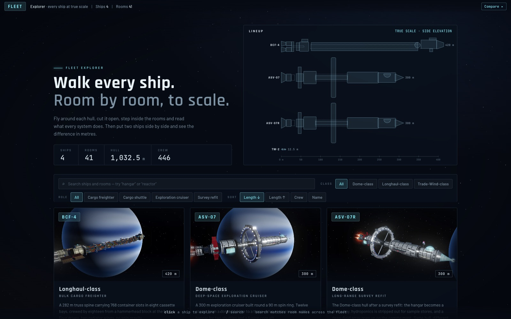
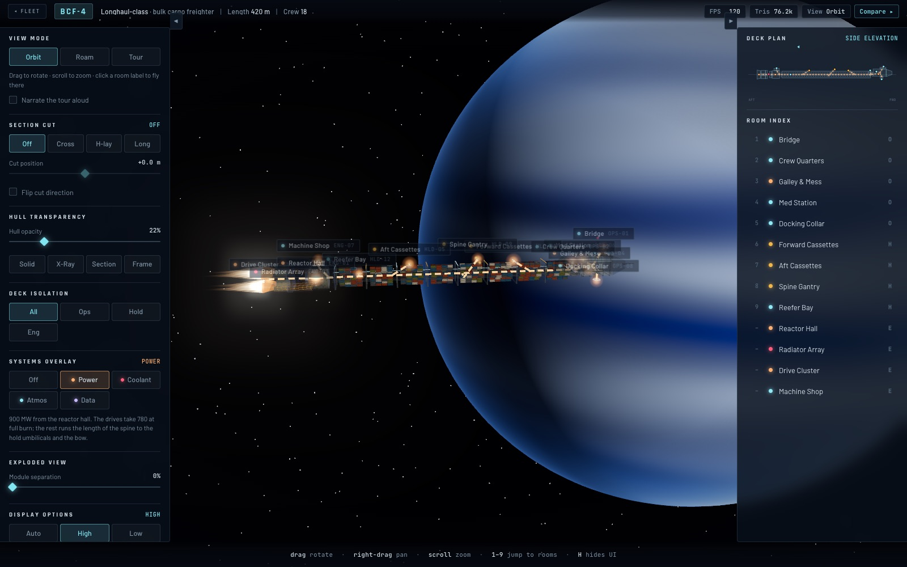
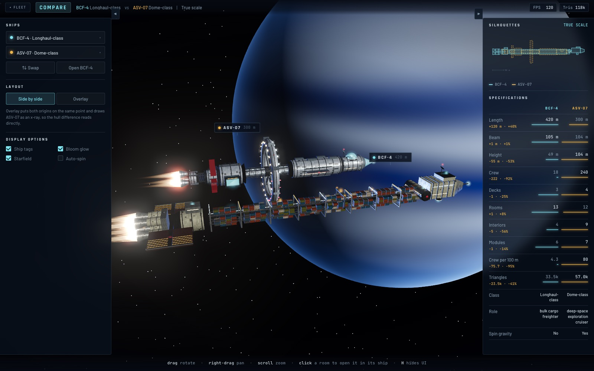

# Fleet Explorer

Interactive 3D spacecraft explorer. Fly around each ship, cut it open, step into its rooms, trace its power and coolant runs, and compare any two ships at true scale.



The viewer is generic three.js; every ship is data in `ships/<id>/`. Adding a ship means adding a folder, not editing `src/`.

| Ship | Class | Length | Notes |
|---|---|---|---|
| `asv-07` | Dome-class exploration cruiser | 300 m | Spin ring, 12 rooms, the original demo |
| `asv-07r` | Dome-class survey refit | 300 m | A variant: `ship.json` with `extends`, no model of its own |
| `bcf-4` | Longhaul-class freighter | 420 m | 768 container slots, 3 decks, no ring |
| `tw-2` | Trade-Wind-class shuttle | 12.5 m | Linked from the ASV-07 hangar and the BCF-4 docking collar |
| `test-brick` | fixture | 30 m | Hand-written glTF that proves the loader is generic; hidden from the index |

## What the viewer does

- **Orbit, roam and tour**, with narrated captions and optional speech.
- **Section cuts**, hull opacity presets, deck isolation, exploded view, wireframe.
- **Rooms**: labels with hull occlusion, a live side-elevation deck plan, fly-to, step inside, hotspots in interiors, links to rooms in the same or another ship.
- **Systems overlay**: power, coolant, atmosphere and data drawn as animated routes through the hull and mirrored in the deck plan.
- **Compare**: two ships in one scene, side by side or overlaid, silhouettes at true scale and a stat table with deltas.
- **Auto quality** under 40 fps, a bottom-sheet layout under 900 px, deep links for ship, room, mode and system.




## Commands

```bash
npm install
npm run dev          # http://localhost:5173
npm run build        # dist/
npm run validate     # schema, mesh names, links, budgets (headless)
npm run shots        # every ship × solid / x-ray / section vs reference/goldens
npm run hero         # ships/<id>/hero.webp for the index
```

Budgets per ship: 150k triangles, 300 draw calls, model length within 15% of `length_m`, glTF under 8 MB. Tagged meshes are merged at load, which takes the ASV-07 from 674 draw calls to 112.

## Adding a ship

1. `ships/<id>/ship.json`: decks, rooms, modules, plan, tour, camera, materials. `src/schema.ts` is the reference.
2. A model: `build.js` against the `BuildApi` in `src/ship/builder.ts`, or a `model.glb` with nodes named `hull_<deck>_*`, `int_<room>_*`, `glow_*`, `room_<CODE>`, `mod_<id>`, `spin_<id>`.
3. `npm run validate`, then `npm run hero`.

A refit is a `ship.json` with `extends`, `roomPatches` (null retires a room) and `addRooms`.

See `CLAUDE.md` for conventions, `ROADMAP.md` for the plan and `NOTES.md` for what each phase changed.
